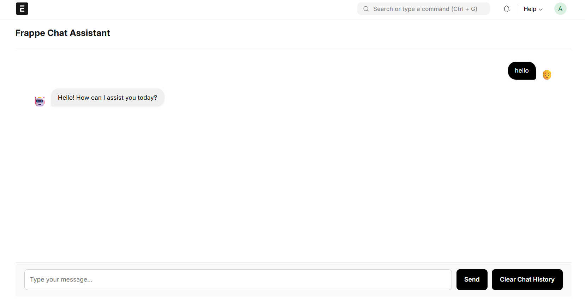
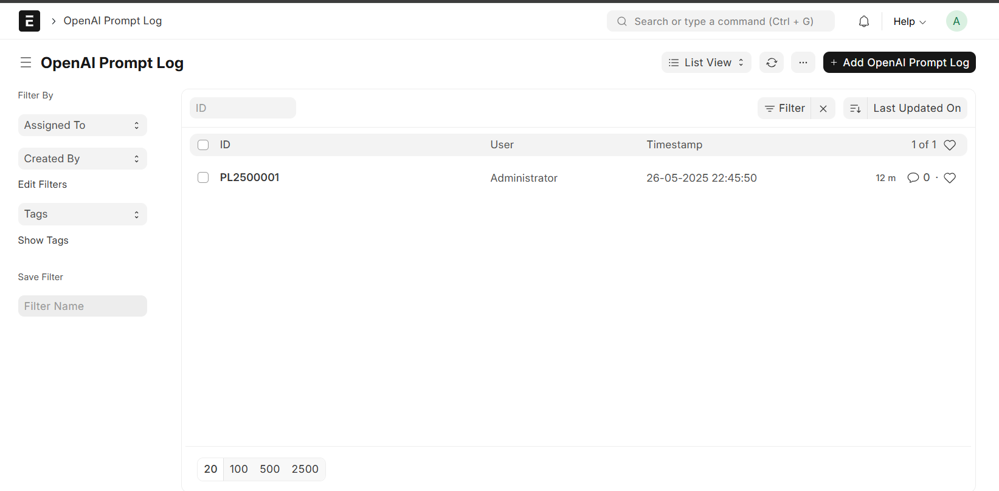
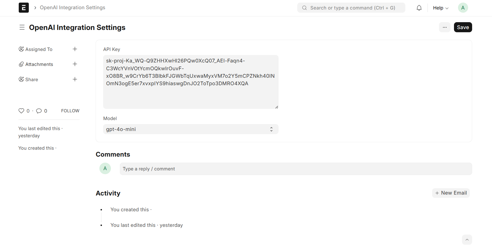
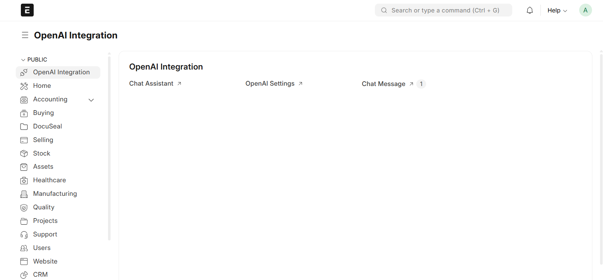

# 🧠 LLM Integration for Frappe

A powerful custom Frappe app that integrates Large Language Models (LLMs) like those from OpenAI (e.g., ChatGPT) or locally run models via Ollama into your ERP system. This tool enables users to interact with LLM APIs directly from the Frappe interface, submit prompts, and view generated responses with a seamless, user-friendly UI.

---

## 🌟 Features

- ✍️ Prompt Submission Interface (Chat-style)
- 📬 View LLM-generated responses in real-time
- 🧾 Prompt history tracking
- ⚙️ Configurable LLM Providers:
    - **Ollama**: Connect to a locally running Ollama instance.
    - **OpenAI**: Use OpenAI's API with your key.
- 📦 **Query Item Stock Levels**: Ask the chat assistant about the stock levels of items in your ERPNext inventory.
- 📊 Dashboard showing prompt stats (total prompts, settings, etc.)
- 🔐 Role-based access control for using AI features
- 💬 Multi-message threads or single prompts

---

## 🖼️ UI Screenshots

1. **Prompt Input Interface**

   - Input your question to the configured LLM
   - Get immediate response via API
   - Save history for reference
2. **Prompt History Listing**

   - View all past queries and responses
   - Filter by user/date/type

3. **OpenAI Settings**

   - Configure API keys
   - Toggle model options (e.g., `gpt-3.5`, `gpt-4`)

4. **Dashboard**

   - Shows:
     - OpenAI Settings
     - Total prompts
     - Chat Assistant

---

## 🛠️ Installation

Make sure you have Frappe set up.

```bash
# Get the app
$ bench get-app https://github.com/manavmandli/frappe_openai_integration.git

# Install on your site
$ bench --site yoursite install-app frappe_openai_integration

# Install required Python libraries
$ bench pip install openai ollama

---

## ⚙️ Configuration

After installation, navigate to "Home > Integrations > LLM Integration Settings" in your Frappe desk.

1.  **Choose your LLM Provider**:
    *   `ollama`: For using a local Ollama instance.
    *   `openai`: For using the OpenAI API.

2.  **Configure Provider-Specific Settings**:
    *   If **Ollama** is selected:
        *   **Ollama API URL**: Enter the URL of your Ollama service.
            *   If Ollama is running on the same machine as your Frappe development server (not in Docker), this is typically `http://localhost:11434`.
            *   If Frappe/ERPNext is running inside a Docker container and Ollama is running on the host machine, use `http://host.docker.internal:11434` to allow the container to access the host.
            *   Ensure the Ollama service is accessible from your Frappe environment and that the selected model (e.g., `llama2`, `mistral`) is downloaded and available in Ollama (`ollama pull llama2`).
    *   If **OpenAI** is selected:
        *   **OpenAI API Key**: Enter your secret API key from OpenAI.

3.  **Select Model**:
    *   Choose a model from the dropdown. The available models will be a mix of common OpenAI and Ollama models. Ensure the selected model is compatible with your chosen provider. "Auto" will select a default model for the chosen provider.

4.  Save the settings.

Now you can access the "Frappe Chat Assistant" page from your desk and start interacting with the configured LLM.

---

## 🗣️ Interacting with ERPNext Data (Proof of Concept)

This integration includes a proof-of-concept feature allowing you to query item stock levels directly through the chat interface.

### Querying Item Stock

You can ask questions about the stock of specific items. The system will attempt to find the item in your ERPNext database and provide its current stock levels across different warehouses as context to the LLM.

**Example Prompts:**

*   "What is the stock of ITEM-CODE-123?"
*   "How many "My Awesome Product" do we have in inventory?"
*   "Tell me the quantity available for 'LAPTOP-001'."
*   "inventory for ITEM-XYZ"

**How it Works (Simplified):**

1.  When you ask a question that includes keywords like "stock", "inventory", "how many", "quantity", etc., and an identifiable item name or code (e.g., "ITEM-CODE-123" or "My Awesome Product" in quotes).
2.  The system fetches the current stock data for that item from your ERPNext (specifically from the `Bin` doctype).
3.  This stock data is then added as context to your original question before sending it to the selected LLM (Ollama or OpenAI).
4.  The LLM uses this context to answer your question.

**Important Notes for this Proof-of-Concept:**

*   **Item Identification:** The current item identification is basic. It looks for item codes or names enclosed in double or single quotes. For best results, use the exact item code or provide the item name in quotes.
*   **Error Handling:** If an item isn't found or has no stock, this information is passed to the LLM as part of the context. The LLM should then inform you accordingly.
*   **Scope:** This feature currently only supports querying item stock levels. More complex queries or other data types are not yet supported in this phase.

This functionality is a first step towards deeper integration with your ERPNext data. Future enhancements will improve the natural language understanding and expand the range of queries and actions possible.
